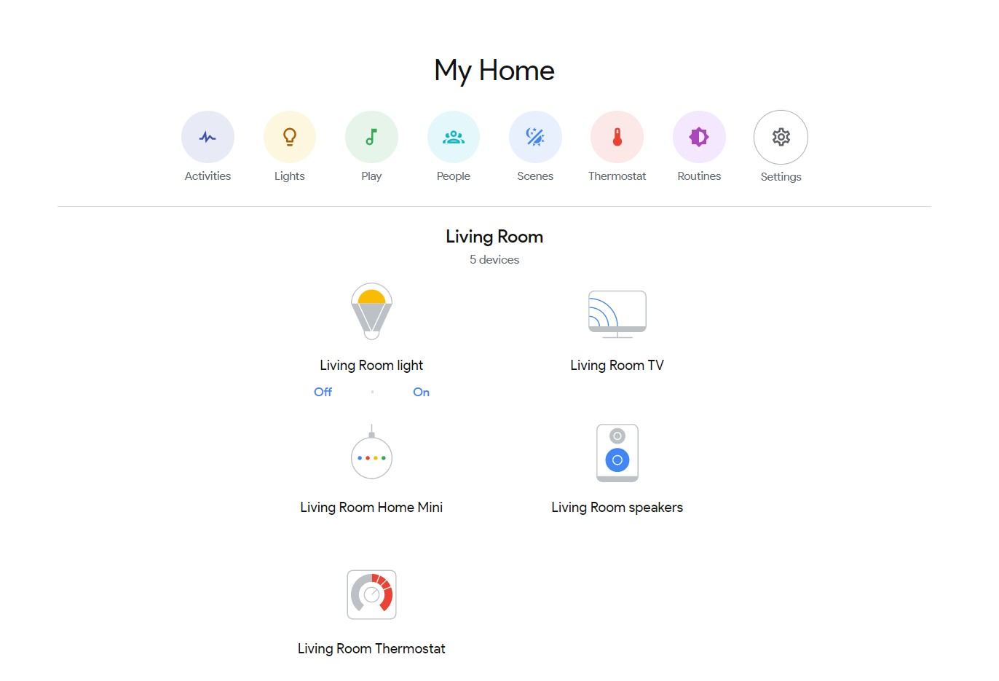

# google-home-assistant

**Turn your Home Assistant interface into something that closely resembles the Google Home app using this set of custom Lovelace components.**

## Usage

Install the latest `google-home-assistant` release by getting the compiled `google-home-assistant.js` file from [here](https://github.com/nielsrowinbik/google-home-assistant/releases/latest) and including it as a `module` in `ui-lovelace.yaml`:

```yaml
resources:
    - url: /local/js/google-home-assistant.js
      type: module
```

Set up your `ui-lovelace.yaml` with a panel view, and wrap the `google-home-assistant` cards in a `vertical-stack-card`.

```yaml
views:
    - title: My Home
      icon: mdi:home-variant-outline
      path: home
      panel: true
      cards:
          - type: vertical-stack
            cards:
                - type: custom:google-home-menu
                  title: My Home
                  cards:
                      - type: custom:google-home-menu-item
                        color: yellow
                        entity: group.all_lights
                        icon: mdi:lightbulb-outline
                        name: Lights
                - type: custom:google-home-grid
                  title: Living Room
                  cards:
                      - type: custom:google-home-grid-item
                        entity: media_player.living_room_tv
                        icon: /local/icons/chromecast.svg
                        name: Living Room TV
                      - type: custom:google-home-grid-item
                        entity: media_player.living_room_speakers
                        icon: /local/icons/chromecast_audio.svg
                        name: Living Room speakers
```

All done! See below for each of the available [cards](#cards) and [getting the full experience](#getting-the-full-experience).



## Getting the full experience

In order to get the full Google Home experience, try doing the following.

#### 1. Install a (very) bright theme

The Google Home app is mostly white, so to get the full experience, install a mostly white theme. Find an example [here](https://github.com/nielsrowinbik/home/blob/master/themes/light.yaml). Please note that this theme is based on my personal use cases and as such may not set all colours correctly.

#### 2. Load the Product Sans font

I cannot redistribute the Product Sans font, but it is possible to get your hands on it and load it through your `ui-lovelace.yaml`:

```yaml
resources:
    - url: /link/to/product-sans.css
      type: css
```

#### 3. Use the icons from the Google Home app

Again, I cannot redistribute the icons but it is possible to get them from the Google Home app APK and use them in your Home Assistant:

1. Download the APK from [APKMirror](https://www.apkmirror.com)
2. Change the file extension from `.apk` to `.zip`
3. Look around and find the [Lottie]() animations
4. Use [this online tool](https://lottie-to-svg.netlify.com) I created to get the static SVG files (support for Lottie animations files is an idea I'm playing with, see #6)
5. Upload the SVG's to your Home Assistant's `www` folder and reference them in the card configurations (see example above)

## Cards

The module enables the following cards (click for their configuration options):

-   [`google-home-menu`](#google-home-menu-configuration-options)
-   [`google-home-menu-item`](#google-home-menu-item-configuration-options)
-   [`google-home-grid`](#google-home-grid-configuration-options)
-   [`google-home-grid-tem`](#google-home-grid-item-configuration-options)

### `google-home-menu` configuration options

| Name  | Type   | Requirement  | Description                     | Default |
| ----- | ------ | ------------ | ------------------------------- | ------- |
| type  | string | **Required** | `custom:google-home-menu`       |         |
| cards | list   | **Required** | List of cards to display        |         |
| title | string | Optional     | Title to display above the menu | `""`    |

### `google-home-menu-item` configuration options

| Name   | Type   | Requirement  | Description                                                             | Default                  |
| ------ | ------ | ------------ | ----------------------------------------------------------------------- | ------------------------ |
| type   | string | **Required** | `custom:google-home-menu-item`                                          |                          |
| entity | string | **Required** | Home Assistant Entity ID                                                |                          |
| color  | string | Optional     | `blue`, `cyan`, `green`, `indigo`, `purple`, `red`, `yellow`, or `none` | `none`                   |
| icon   | string | Optional     | Reference to a Material Design icon (has to start with `mdi:`)          | entity's `icon`          |
| name   | string | Optional     | Override the entity's friendly name                                     | entity's `friendly_name` |

### `google-home-grid` configuration options

| Name  | Type   | Requirement  | Description                     |
| ----- | ------ | ------------ | ------------------------------- |
| type  | string | **Required** | `custom:google-home-grid`       |
| cards | list   | **Required** | List of cards to display`       |
| title | string | **Required** | Title to display above the grid |

### `google-home-grid-item` configuration options

| Name    | Type   | Requirement  | Description                                                    | Default                  |
| ------- | ------ | ------------ | -------------------------------------------------------------- | ------------------------ |
| type    | string | **Required** | `custom:google-home-grid-item`                                 |                          |
| entity  | string | **Required** | Home Assistant Entity ID                                       |                          |
| actions | list   | Optional     | List of actions to display below the grid item (options below) | `[]`                     |
| icon    | string | Optional     | Reference to a Material Design icon or an image                | entity's `icon`          |
| name    | string | Optional     | Override the entity's friendly name                            | entity's `friendly_name` |

Grid item action options:

| Name    | Type              | Requirement  | Description                                                                |
| ------- | ----------------- | ------------ | -------------------------------------------------------------------------- |
| service | string            | **Required** | Service to call when the action is clicked                                 |
| label   | string            | **Required** | Text to display inside the action's button                                 |
| state   | string or boolean | Optional     | Only display the action when the grid item's entity has the provided state |
